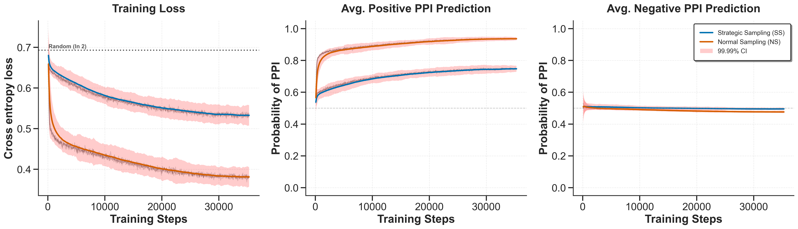

# Protein Language Models are Accidental Taxonomists

[]()
[](https://www.python.org/)
[](https://pytorch.org/)
[]()

This repository contains the code and data for reproducing the experiments in *"Protein Language Models are Accidental Taxonomists"*. We demonstrate that protein language model (pLM)-based PPI predictors can exploit phylogenetic signals in multi-species datasets, achieving artificially inflated performance by learning to distinguish taxonomic origin rather than genuine interaction features.

## Table of Contents

- [Overview](#overview)
- [Key Findings](#key-findings)
- [Installation](#installation)
- [Reproducing Experiments](#reproducing-experiments)
- [Code Architecture](#code-architecture)
- [Model Architecture](#model-architecture)
- [Dataset Construction](#dataset-construction)
- [Results](#results)
- [Citation](#citation)

---

## Overview

Protein-protein interaction (PPI) prediction is a fundamental problem in computational biology. While pLM-based methods report high performance on multi-species datasets, we hypothesize that much of this performance stems from an unintended shortcut: **models learn to detect whether two proteins share a taxonomic origin**, rather than learning genuine interaction features.

### The Accidental Taxonomist Hypothesis

In standard multi-species PPI datasets with random negative sampling:
- **Positive pairs**: Almost exclusively from the same species (real PPIs occur within organisms)
- **Negative pairs**: ~70% from different species (random sampling across the dataset)

This creates a strong correlation between label and phylogenetic distance that models can exploit.

---

## Key Findings

| Finding | Evidence |
|---------|----------|
| **Phylogenetic bias in datasets** | Only ~31% of randomly sampled negatives share species origin |
| **pLMs encode taxonomy** | 0.87 F1 score distinguishing same vs. different species pairs |
| **Models exploit this signal** | NS models: 0.71 MCC (validation) → 0.23 MCC (SS test set) |
| **Reward hacking in training dynamics** | NS positive predictions reach 0.94 vs 0.75 for SS |
| **Strategic sampling prevents cheating** | SS models maintain consistent 0.37-0.39 MCC across splits |
| **Multi-species data still helps** | SS models outperform single-species SOTA (0.37 vs 0.30 MCC) |

---

## Installation

### Prerequisites

- Python 3.8+
- CUDA-capable GPU (recommended)
- Docker (required for CD-HIT sequence clustering)

### Setup

```bash
# Clone repository
git clone https://github.com/Gleghorn-Lab/PLMConfounders.git
cd PLMConfounders

# Install dependencies
pip install -r requirements.txt
```

**Windows users**: Ensure Docker Desktop is running before executing training scripts. The pipeline uses Docker containers for CD-HIT clustering.

---

## Reproducing Experiments

### Full Paper Reproduction

**Note**: Before running the experiments, unzip the datasets in `processed_datasets/`:
- `SS_train.zip` → `split_with_sim_biogrid_0.4_True_train.csv`
- `NS_train.zip` → `split_with_sim_biogrid_0.4_False_train.csv`
- `eval_sets.zip` → `split_with_sim_biogrid_0.4_True_val.csv`, `split_with_sim_biogrid_0.4_True_test.csv` `split_with_sim_biogrid_0.4_False_val.csv`, `split_with_sim_biogrid_0.4_False_test.csv` 

To reproduce the complete NS vs. SS experiment from the paper:

```bash
py -m training.biogrid_exp --reproduce_paper
```

This executes:
1. Downloads BioGRID data via HuggingFace (`Synthyra/BIOGRID`)
2. Clusters sequences at 40% identity using CD-HIT (Docker)
3. Constructs C3 train/validation/test splits (no sequence overlap)
4. Generates negatives via Normal Sampling (NS) and Strategic Sampling (SS)
5. Trains 5 models per condition with seeds (which were originally randomly chosen) `[314, 550, 576, 669, 842]`
6. Evaluates all models on SS test set to reveal cheating behavior

**Hardware requirements**: Full training requires ~20GB GPU memory, ~300 GB of system memory, and takes ~4 hours per training run on a GH200.

### Quick Testing

For development or verification:

```bash
py -m training.biogrid_exp --bugfix
```

This uses reduced dataset size, smaller model, and faster clustering threshold.

### Key Arguments

| Argument | Default | Description |
|----------|---------|-------------|
| `--plm_path` | `esmc_600m` | pLM for embedding generation |
| `--similarity_threshold` | `0.4` | CD-HIT clustering threshold |
| `--batch_size` | `128` | Training batch size |
| `--max_length` | `512` | Maximum sequence length |
| `--n_runs` | `5` | Number of seeds per condition |
| `--save_every` | `5000` | Evaluation frequency (steps) |
| `--reproduce_paper` | `False` | Use exact paper seeds |

---

## Code Architecture

```
PLMConfounders/
├── data/
│   ├── biogrid.py          # Data loading, splitting, negative generation
│   └── data.py             # PyTorch Dataset and Collator classes
├── model/
│   ├── ppi_model.py        # Main PPIModel architecture
│   ├── attention.py        # Attention mechanisms (MHA, AttentionPooler)
│   ├── blocks.py           # Transformer blocks
│   ├── rotary.py           # Rotary positional embeddings
│   └── utils.py            # Linear layers, normalization utilities
├── training/
│   ├── biogrid_exp.py      # Main training script and BiogridBinaryTrainer
│   └── utils.py            # Argument parsing, seed setting, gradient clipping
├── processed_datasets/     # Cached train/val/test CSVs
├── accidental_taxonomist/                # Model checkpoints and metrics logs
└── sequence_data/          # FASTA files and CD-HIT outputs
```

### Key Components

#### Data Pipeline (`data/biogrid.py`)

The data pipeline implements rigorous evaluation splits following Park & Marcotte's C3 strategy:

1. **Sequence clustering**: CD-HIT at 40% identity threshold
2. **Cluster-based splitting**: Entire clusters assigned to train/val/test (no protein overlap)
3. **Negative generation**: 
   - `matching_orgs=False` (NS): Random pairs from different species
   - `matching_orgs=True` (SS): Random pairs within same species
4. **Test set**: Always uses SS negatives to detect cheating

```python
# Core negative generation logic (simplified)
if matching_orgs:
    org_2 = org_1  # Same species
else:
    org_2 = sample_different_species(org_1)  # Different species
```

#### Model Architecture (`model/ppi_model.py`)

The `PPIModel` processes two protein sequences through parallel encoder tracks before interaction modeling:

```python
class PPIModel(PreTrainedModel):
    def forward(self, a, b, a_mask, b_mask):
        # Parallel encoding tracks
        a = self.featurize_a(a, a_mask)  # (B, n_tokens, D)
        b = self.featurize_b(b, b_mask)  # (B, n_tokens, D)
        
        # Concatenate and process through transformer blocks
        x = torch.cat([a, b], dim=1)  # (B, 2*n_tokens, D)
        x = self.block_1(x)  # ... hierarchical dimension reduction
        
        # Final prediction
        logits = self.final_proj(x).mean(dim=1)  # (B, 1)
        return PPIOutput(logits=logits)
```

#### Attention Pooling (`model/attention.py`)

Variable-length sequences are pooled to fixed-size representations via learned cross-attention:

```python
class AttentionPooler(nn.Module):
    """(B, L, D) → (B, n_tokens, D) via learned query tokens"""
    def forward(self, x, attention_mask):
        q = self.Wq(self.Q)  # Learned queries: (1, n_tokens, D)
        k, v = self.Wk(x), self.Wv(x)  # Keys/values from input
        return scaled_dot_product_attention(q, k, v, attn_mask)
```

---

## Model Architecture

The PPI prediction model is a hierarchical transformer that processes pLM embeddings:

```
Input: Protein A embeddings (batch_size, l_a, 1152)
       Protein B embeddings (batch_size, l_b, 1152)
                    ↓
┌──────────────────────────────────────────────┐
│  Parallel Encoder Tracks (separate weights)  │
│   ┌─────────────────┐  ┌─────────────────┐   │
│   │ Linear: 1152→512│  │ Linear: 1152→512│   │
│   │ Transformer Blk │  │ Transformer Blk │   │
│   │ AttentionPooler │  │ AttentionPooler │   │
│   │   (L→32 tokens) │  │   (L→32 tokens) │   │
│   └────────┬────────┘  └────────┬────────┘   │
│            │                    │            │
│            └──────┬─────────────┘            │
│                   ↓                          │
│         Concatenate: (B, 64, 512)            │
└──────────────────────────────────────────────┘
                    ↓
┌──────────────────────────────────────────────┐
│  Interaction Modeling (4 Transformer Blocks) │
│  512 → 256 → 128 → 64 (progressive reduction)│
└──────────────────────────────────────────────┘
                    ↓
           Mean Pool → Linear → Logit (b, 1)
```

**Key design choices**:
- **Frozen pLM embeddings**: ESMC-600M embeddings extracted offline
- **Separate encoder tracks**: Each protein has its own encoder weights (not shared)
- **Random input swapping**: During training, A↔B orientation is randomly swapped to prevent order bias
- **Attention pooling**: Handles variable-length sequences with minimal information loss
- **Rotary positional embeddings**: Position-aware attention without absolute encodings
- **Hierarchical reduction**: Progressive dimensionality reduction through transformer blocks

---

## Dataset Construction

### Splitting Strategy (C3)

Following Park & Marcotte's + Bernett's strictest evaluation protocol:

1. **Cluster all proteins** at 40% sequence identity
2. **Assign clusters** (not individual proteins) to splits
3. **Guarantee**: No protein in valid or test appears in train (even at 40% similarity). No overlap in valid or test either.

### Negative Sampling Comparison

| Approach | Training Negatives | Validation Negatives | Test Negatives |
|----------|-------------------|---------------------|----------------|
| **Normal Sampling (NS)** | Cross-species (~70%) | Cross-species | Same-species |
| **Strategic Sampling (SS)** | Same-species only | Same-species | Same-species |

The test set always uses same-species negatives to reveal whether models learned taxonomy vs. PPI.

### Dataset Statistics

| Split | Examples | Positives | Negatives | Unique Proteins |
|-------|----------|-----------|-----------|-----------------|
| Train | 4,523,432 | 2,261,716 | 2,261,716 | ~70,000 |
| Valid | 10,070 | 5,035 | 5,035 | ~3,000 |
| Test | 10,034 | 5,017 | 5,017 | ~3,000 |

---

## Results

### NS vs. SS Performance Comparison

| Metric | NS (Validation) | NS (Test) | SS (Validation) | SS (Test) |
|--------|-----------------|-----------|-----------------|-----------|
| MCC | **0.71** | 0.23 | 0.39 | **0.37** |
| Accuracy | 85% | 62% | 70% | 68% |
| F1 | 0.87 | 0.61 | 0.70 | 0.69 |
| ROC-AUC | 0.92 | 0.63 | 0.75 | 0.73 |

The dramatic drop in NS performance (0.71 → 0.23 MCC) when evaluated on same-species negatives confirms the accidental taxonomist hypothesis.

### Training Dynamics Reveal Reward Hacking

Analysis of training dynamics exposes how NS models exploit phylogenetic signals:

| Metric | NS | SS |
|--------|----|----|
| Training Loss | **0.38** (lower) | 0.54 |
| Avg. Positive Prediction | 0.94 | 0.75 |
| Avg. Negative Prediction | ~0.50 | ~0.50 |

**Key observations:**
- NS models achieve lower training loss by exploiting the phylogenetic shortcut
- NS positive predictions approach 0.94 (extreme confidence), indicating reward hacking behavior
- Both approaches show similar difficulty classifying negatives (~0.50 probability)
- The divergent trajectories are statistically significant (99.99% CI bands are non-overlapping)



### Comparison to Prior Work

| Method | Dataset | Test MCC |
|--------|---------|----------|
| Bernett et al. SOTA | Human-only | 0.30 |
| **This work (SS)** | Multi-species | **0.37** |

Strategic sampling enables multi-species training that genuinely improves generalization.

**Note**: All training runs can be viewed in detail on Weights and Biases.

[Report](https://wandb.ai/lhallee/Accidental%20Taxonomists%20PPI/reports/Accidental-Taxonomists-PPI--VmlldzoxNTM5MTkwNQ)

[Raw](https://wandb.ai/lhallee/Accidental%20Taxonomists%20PPI).

---

## Citation

```bibtex
@article{hallee2025accidental,
  title={Protein Language Models are Accidental Taxonomists},
  author={Hallee, Logan and Peleg, Tamar and Rafailidis, Nikolaos and Gleghorn, Jason P.},
  journal={bioRxiv},
  year={2025}
}
```

---

## Data Availability

| Resource | Location |
|----------|----------|
| BioGRID source data | [Synthyra/BIOGRID](https://huggingface.co/datasets/Synthyra/BIOGRID) |
| Processed datasets | `processed_datasets/` (generated on first run) |
| Taxonomy probe datasets | [GleghornLab/Protify](https://huggingface.co/collections/GleghornLab/protify) |
| Model checkpoints | `accidental_taxonomist_results/biogrid_species_experiment/` |
| Training runs & metrics | [Wandb Project](https://wandb.ai/lhallee/Accidental%20Taxonomists%20PPI) |

---

## Authors

- **Logan Hallee** - University of Delaware & Synthyra - [lhallee@udel.edu](mailto:lhallee@udel.edu)
- **Tamar Peleg** - University of Delaware
- **Nikolaos Rafailidis** - University of Delaware
- **Jason P. Gleghorn** - University of Delaware & Synthyra

## Acknowledgements

This work was supported by the University of Delaware Graduate College (Unidel Distinguished Graduate Scholar Award), National Science Foundation (NAIRR pilot 240064), and National Institutes of Health (NIGMS T32GM142603, R01HL178817, R01HL133163, R01HL145147).

## License

MIT License. See LICENSE for details.

---

**Questions?** Open an issue or contact [lhallee@udel.edu](mailto:lhallee@udel.edu)
